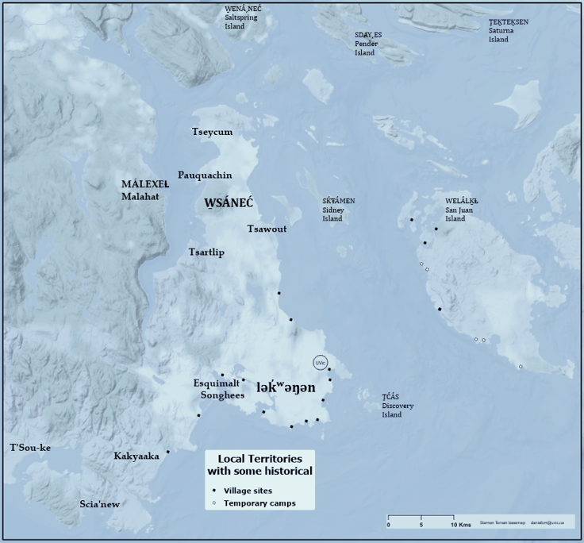

# Land acknowledgement

We acknowledge the Indigenous lands where we are located.    

We acknowledge and respect the Lək̓ʷəŋən (Songhees and Xʷsepsəm/Esquimalt) Peoples on whose territory the university stands, and the Lək̓ʷəŋən and W̱SÁNEĆ Peoples whose historical relationships with the land continue to this day.

Visit [native-land.ca](https://native-land.ca/) to explore the Indigenous territories, languages, and treaties in your area.

<iframe width="560" height="315" src="https://www.youtube.com/embed/jAgS8kOsjYY?si=bUyg-X7E9kfeuSoH" title="YouTube video player" frameborder="0" allow="accelerometer; autoplay; clipboard-write; encrypted-media; gyroscope; picture-in-picture; web-share" referrerpolicy="strict-origin-when-cross-origin" allowfullscreen></iframe>

